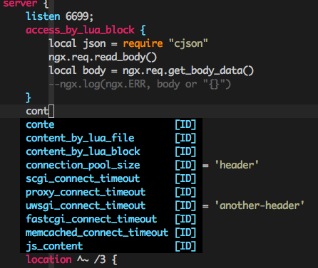

## A Vim plugin offers Nginx/Openresty syntax highlight and directives completion



This little plugin offers:
1. syntax highlight for Nginx configuration, with addition OpenResty enhancement.
1. syntax highlight for LuaJIT source file, with adddition OpenResty API highlight.
1. syntax-based directives completion.

#### Support version

This plugin supports OpenResty v1.21.4.

#### How to use

First of all, install this plugin with your favorite plugin manager.

The syntax highlight is enabled once your file is detected as Nginx configuration.
If Vim doesn't recognize the file type, you could add this to your `.vimrc`:

```
autocmd BufRead,BufNewFile pattern_matched_your_file(s) set filetype=nginx
```

For example, `autocmd BufRead,BufNewFile nginx_*.conf.tpl set filetype=nginx`.

To complete the directives, type part of the word and then type `Ctrl+x Ctrl+o` to trigger it.
If you are using [YouCompleteMe](https://github.com/Valloric/YouCompleteMe), set `let g:ycm_seed_identifiers_with_syntax = 1` in your `.vimrc`.

#### Known issue

There is a limit to render Lua snippet inside `_by_lua_block` directives. You need to close the block with `}` in separate line, and `}` should have
the same indent with the `{`. It is a hack to distinguish from `}` of the inner Lua snippet.
Anyway, if your configuration is in good format, the highlight should work smoothly.
